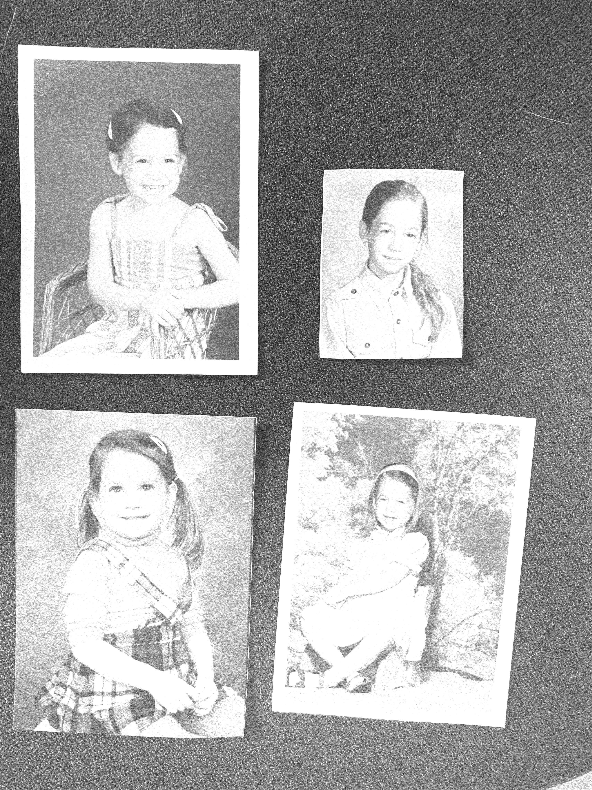

# Slide Templates — Legend

Quick reference for the slide templates available in this deck. Each template has a short name, ASCII layout, use case, and the minimum HTML structure needed.

> **Note:** Registration marks, guide lines, the speaker/conference footer and the progress bar are all injected by JavaScript at initialisation. Do not include them in your markup.

All templates go inside:

```html
<section>
  <div class="slide slide--<layout>">

    <!-- template content goes here -->

    <aside class="notes">speaker notes</aside>
  </div>
</section>
```

---

## `split-photo-right`

Text left, photo right. Good for: title slide, split content with image support, observations.

```
+--------------------+--------------------+
|                    |                    |
|  [LABEL]           |                    |
|                    |       PHOTO        |
|  headline          |                    |
|  spans two lines   |   (can include     |
|                    |    instrument      |
|  optional subtitle |    overlay)        |
|                    |                    |
+--------------------+--------------------+
```

```html
<div class="slide slide--split">
  <div class="slide-text">
    <span class="label">Label</span>
    <h1>Headline</h1>
    <p class="text-light text-small">optional subtitle</p>
  </div>
  <div class="slide-photo">
    
    <!-- optional instrument, positioned relative to photo cell -->
    <div class="instrument instrument--orange instrument--lg instrument--bleed-left">
      
    </div>
  </div>
</div>
```

---

## `split-photo-left`

Photo left, text right. Good for: section dividers, chapter intros.

```
+--------------------+--------------------+
|                    |                    |
|                    |  [LABEL]           |
|       PHOTO        |                    |
|                    |  headline          |
|   (can include     |  spans two lines   |
|    instrument      |                    |
|    overlay)        |                    |
|                    |                    |
+--------------------+--------------------+
```

```html
<div class="slide slide--split slide--text-right">
  <div class="slide-photo">
    
  </div>
  <div class="slide-text">
    <span class="label">Chapter One</span>
    <h2>Heading</h2>
  </div>
</div>
```

---

## `bio`

Portrait left (fixed ~280px), bio text right. Good for: speaker intro.

```
+----------+-------------------------------+
|          | [LABEL]                       |
|          |                               |
| PORTRAIT | Name                          |
|          |                               |
|          | Body copy about the speaker.  |
|          |                               |
+----------+-------------------------------+
```

```html
<div class="slide slide--bio">
  <div class="slide-photo">
    
  </div>
  <div class="slide-text">
    <span class="label">About</span>
    <h2>Name</h2>
    <p>Bio text.</p>
  </div>
</div>
```

---

## `photo-top`

Full-width photo on top, label + heading strip below. Good for: emotional punctuation, context setting.

```
+-------------------------------------------+
|                                           |
|                  PHOTO                    |
|                                           |
|              (full width)                 |
|                                           |
+-------------------------------------------+
| [LABEL]  heading text                     |
+-------------------------------------------+
```

```html
<div class="slide slide--photo-top">
  <div class="slide-photo">
    
  </div>
  <div class="slide-text">
    <span class="label">Context</span>
    <h2>Heading</h2>
  </div>
</div>
```

---

## `statement`

Big text, filling most of the slide, optional small instrument accent. Good for: key findings, punchline statements, emphasis.

```
+-------------------------------------------+
|                             [instrument]  |
|                                           |
|  Big statement text that                  |
|  takes up most of the slide               |
|  and says something important.            |
|                                           |
|                                           |
|  [LABEL]                                  |
+-------------------------------------------+
```

```html
<div class="slide slide--statement">
  <div class="slide-statement">
    Big statement text.
  </div>
  <div class="slide-statement-label">
    <span class="label">Finding</span>
  </div>

  <!-- optional instrument accent -->
  <div class="instrument instrument--orange instrument--sm instrument--accent instrument--accent-tr">
    
  </div>
</div>
```

---

## `quote`

Centered italic quote with chevron marks, optional attribution. Good for: pull quotes, emotional beats, bridge moments between sections.

```
+-------------------------------------------+
|                                           |
|                   «                       |
|                                           |
|      italic quote text centered           |
|       across the slide can be long        |
|                                           |
|                   »                       |
|                                           |
|              attribution                  |
+-------------------------------------------+
```

```html
<div class="slide slide--quote">
  <div class="quote-mark">&laquo;</div>
  <blockquote>
    quote text
  </blockquote>
  <div class="quote-mark">&raquo;</div>
  <p class="quote-attribution">Optional attribution</p>
</div>
```

---

## `list`

Instrument graphic left, numbered list right. Good for: agenda, findings, step-by-step process.

```
+-------------+-----------------------------+
|             |                             |
|             |  01   list item             |
|             |                             |
|  INSTRUMENT |  02   list item             |
|   GRAPHIC   |                             |
|             |  03   list item             |
|             |                             |
|             |                             |
+-------------+-----------------------------+
```

```html
<div class="slide slide--list">
  <div class="slide-graphic">
    
  </div>
  <ol>
    <li>Item one</li>
    <li>Item two</li>
    <li>Item three</li>
  </ol>
</div>
```

---

## `columns-2` / `columns-3`

Two or three equal columns with numbered circles, heading, body. Good for: comparisons, parallel concepts.

```
+---------------------+---------------------+
|                     |                     |
|  ( 1 )              |  ( 2 )              |
|                     |                     |
|  HEADING            |  HEADING            |
|                     |                     |
|  Body copy for      |  Body copy for      |
|  column one.        |  column two.        |
|                     |                     |
+---------------------+---------------------+
```

```html
<div class="slide slide--columns slide--cols-2">
  <div class="slide-col">
    <span class="num-circle">1</span>
    <h3>Heading</h3>
    <p>Body copy.</p>
  </div>
  <div class="slide-col">
    <span class="num-circle num-circle--blue">2</span>
    <h3>Heading</h3>
    <p>Body copy.</p>
  </div>
</div>
```

For 3 columns use `slide--cols-3` instead of `slide--cols-2` and add a third `.slide-col`.

---

## `timeline`

Horizontal track with 4 markers, items alternating above/below the line. Good for: sequential stages, phases of work, chronology.

```
+-------------------------------------------+
|                                           |
|  header                                   |
|                                           |
|  SUBHEAD            SUBHEAD               |
|  description copy   description copy      |
|  │                  │                     |
|  ●────────●─────────●────────●            |
|  01       02        03       04           |
|           │                  │            |
|           SUBHEAD            SUBHEAD      |
|           description copy   description  |
|                                           |
+-------------------------------------------+
```

```html
<div class="slide slide--timeline">
  <h2>Header</h2>
  <div class="timeline">
    <!-- Items above the track (positions 1 and 3) -->
    <div class="timeline__item timeline__item--above" data-pos="1">
      <h3>First item</h3>
      <p>description copy here.</p>
    </div>
    <div class="timeline__item timeline__item--above" data-pos="3">
      <h3>Third item</h3>
      <p>description copy here.</p>
    </div>

    <!-- Markers (all 4 positions) -->
    <div class="timeline__marker" data-pos="1">01</div>
    <div class="timeline__marker" data-pos="2">02</div>
    <div class="timeline__marker" data-pos="3">03</div>
    <div class="timeline__marker" data-pos="4">04</div>

    <!-- Items below the track (positions 2 and 4) -->
    <div class="timeline__item timeline__item--below" data-pos="2">
      <h3>Second item</h3>
      <p>description copy here.</p>
    </div>
    <div class="timeline__item timeline__item--below" data-pos="4">
      <h3>Fourth item</h3>
      <p>description copy here.</p>
    </div>
  </div>
</div>
```

Marker text can be anything short — `01`/`02`/`03`/`04`, years, labels. Items are placed with `data-pos="N"`. Fixed at 4 markers by default.

---

## `padded`

Simple label + heading + bullet list. Good for: activity prompts, audience questions, straightforward content slides.

```
+-------------------------------------------+
|                                           |
|                                           |
|  [LABEL]                                  |
|                                           |
|  the big question / heading               |
|                                           |
|  — option one                             |
|  — option two                             |
|  — option three                           |
|                                           |
+-------------------------------------------+
```

```html
<div class="slide slide--padded">
  <span class="label">Activity</span>
  <h2>The question?</h2>
  <ul class="body-list">
    <li>option one</li>
    <li>option two</li>
    <li>option three</li>
  </ul>
</div>
```

---

## Color modifiers

- `.label` — orange by default
- `.label--blue` — electric blue variant (add alongside `.label`)
- `.instrument--orange` — hot orange fill for SVG instruments
- `.instrument--blue` — electric blue fill for SVG instruments

## Instrument positioning

Use modifier classes instead of inline styles:

- **Size:** `instrument--sm` (100px), `instrument--md` (130px), `instrument--lg` (180px), `instrument--xl`
- **Bleed:** `instrument--bleed-left`, `instrument--bleed-right` (use with `instrument--lg` only)
- **Accent:** `instrument--accent` (sets opacity 0.3) + position: `instrument--accent-tl`, `instrument--accent-tr`, `instrument--accent-bl`, `instrument--accent-br`
- **Rotation:** `instrument--rotate-90`

Example — accent instrument top-right:
```html
<div class="instrument instrument--orange instrument--sm instrument--accent instrument--accent-tr">
  
</div>
```

Example — bleed instrument on photo cell:
```html
<div class="instrument instrument--orange instrument--lg instrument--bleed-left">
  
</div>
```

## Available instrument SVGs

In `img/`:
- `protractor.svg`
- `calipers.svg`
- `compass.svg`
- `ruler.svg`
- `set-square.svg`
- `pressure-gauge.svg`
- `laser-level.svg`
- `tape-measure.svg`
- `micrometer.svg`
- `handsup.svg` — "Hand Up" by kayaheart, [Noun Project](https://thenounproject.com)

## Speaker notes convention

Wrap stage directions (things the speaker *does* rather than *says*) in `<em>` tags:

```html
<aside class="notes"><em>Ask for hands —</em> who prefers X? <em>Pause. Then:</em> 'The thing to say.' <em>Move on.</em></aside>
```
